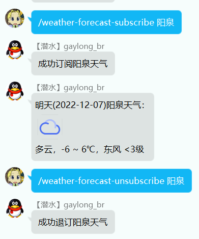

# Weather Forecast Plugin

Mirai 天气预报插件。

支持好友/群聊内订阅多个城市，并在指定时间发送第二天的天气预报。

效果图：（预报发送时间可自定义，图中为开发模式下设置得很快）

&nbsp;

## 环境

* Java 11及以上
* mirai-console 2.11及以上（使用到`JavaAutoSavePluginData`，其是mirai-core于2.11版本更新；开发中实际运行环境为2.13.0，可在[iTXTech/mirai-console-loader](https://github.com/iTXTech/mirai-console-loader)下载安装）
* [chat-command](https://github.com/project-mirai/chat-command/releases)：本插件命令均在聊天环境执行

&nbsp;

## 加载

将Release中的`weather_forecast-*.mirai.jar`下载，并放在mcl的`plugins`文件夹下，随后重新启动mcl。

&nbsp;

## 设置

本插件所使用的天气查询接口为[天气API](https://www.tianqiapi.com/index/doc?version=week)，需要自行注册账户获取appid和appsecret。

插件设置文件位于`config/pers.gaylong9.weather_forecast/pers.gaylong9.WeatherForecastPlugin.config.yml`，其有以下配置项：

* url: 默认`https://v0.yiketianqi.com/free/week`，见查询接口页面所述，有两个可用API，默认用此即可，不需修改
* appid、appsecret: 注册账号后个人页面查看
* tomorrowCron: 依赖Quartz完成定时任务，使用cron表达式定时，默认`0 0 22 ? * SUN-SAT *`，表示每晚10点发送天气预报消息，可自定义；[cron怎么写](https://blog.csdn.net/weixin_40426638/article/details/78959972/)
* todayCron：用于指定何时发送当日天气预报，默认为空，表示不预报当日天气
* timezone: 时区，默认`Asia/Shanghai` 

**修改配置文件前要先关闭MCL。**

&nbsp;

## 权限

由于本插件的命令均需在聊天窗口完成，故使用前还需进行权限分配。参考[官方文档](https://docs.mirai.mamoe.net/console/Permissions.html) 

* 精确好友 `/permission grant u<qq> pers.gaylong9.weather_forecast:*`，如`/permission grant u123456 pers.gaylong9.weather_forecast:*`

* 精确群的所有用户 ` /permission grant m<group>.* pers.gaylong9.weather_forecast:*`，如`/permission grant m123456.* pers.gaylong9.weather_forecast:*`

&nbsp;

## 命令

有权限的用户即可在好友私聊窗口/群聊窗口，发送以下命令，进行操作。

* `/weather-forecast-subscribe <城市名/城市编号>    # 聊天窗口订阅天气预报`

* `/weather-forecast-unsubscribe <城市名/城市编号>    # 聊天窗口退订天气预报`

城市名规范遵循[天气API](https://www.tianqiapi.com/index/doc?version=week)：

> 不要带市和区, 支持市区县, 不支持乡镇级别; 如: 青岛、铁西

可在[city.txt](city.txt)搜索查看，也可在该网站发送请求查看返回json是否合法。

&nbsp;

## 天气图片（可选）

效果图中的天气图片下载自[天气API图标素材](https://yikeapi.com/help/tianqiimg)，图片命名与API返回的`wea_img`属性对应，可自行下载查看。如不设置插件的天气图片，Bot预报时不带图片，不影响主要功能使用。

设置时，先在MCL的`data/pers.gaylong9.weather_forecast/`下新建`wea_img`目录；

随后将从以上链接下载的素材图片，放在`wea_img`目录下，文件路径如`data/pers.gaylong9.weather_forecast/wea_img/qing.png`。

也可使用其他PNG图片，采用相同命名规范，放在wea_img目录下。

&nbsp;

## 更新记录

* 2.0.0：支持重名检测 与 以地区编号订阅。修改了PluginData的数据结构，与1.0.0的PluginData不互通，**需要提前删除1.0.0的插件和data文件**
* 2.0.2：修改预报格式，加入当日温度，能更好地比较出第二天的温度变化
* 2.1.0：加入预报当日天气功能；修改了config文件，为了设置预报当日天气的时间，替换插件文件后需要启动-停止一次Mirai，使插件将新设置项保存进config文件；随后修改config文件中的`todayCron`项，指定预报当日天气的时间；随后再次启动Mirai即可；如不设置该项，就不会预报当日天气，也就无需启停

&nbsp;

## Todo

- [x] 预报今日天气
- [ ] 增加开关今日预报、明日预报的命令
- [ ] 增加设置cron的命令
- [ ] 订阅城市时播报今明两日天气
- [ ] 添加主动查询天气的命令

---

如有任何意见/建议，欢迎issue/contact。